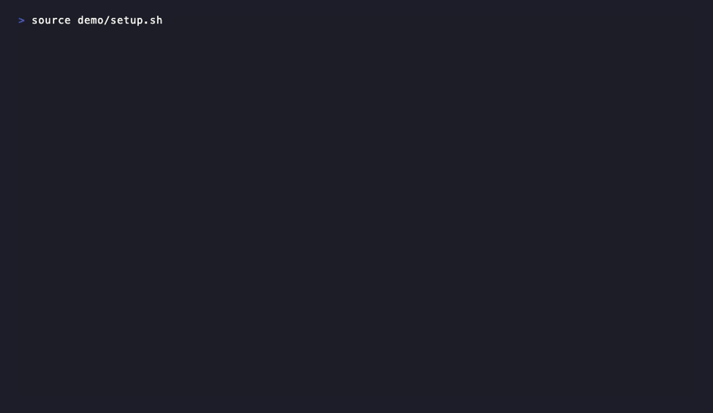

# worktree — git worktree helper

A shell function that wraps `git worktree` with sensible defaults, config-driven scaffolding, and tmux dev sessions. Worktrees are created in a sibling directory (`../<repo>-worktrees/<branch>`) to keep your main repo clean.

The command is `worktree`, with `w` and `wt` set up as aliases by default — use whichever fits your muscle memory.

Two variants are available:
- `w.zsh` — full-featured, requires zsh
- `w.sh` — POSIX sh compatible, works with bash, dash, and others

## Install

### One-liner

```sh
curl -fsSL https://raw.githubusercontent.com/your-org/worktree/main/install.sh | sh
```

The installer auto-detects your shell and adds a source line to your rc file.

### Options

```sh
./install.sh --zsh              # force zsh variant
./install.sh --sh               # force POSIX sh variant
./install.sh --prefix ~/.bin    # custom install directory
./install.sh --dry-run          # preview without making changes
```

### Manual

Source the appropriate file in your `.zshrc` / `.bashrc` / `.profile`:

```sh
# zsh
source ~/path/to/w.zsh

# bash / sh
. ~/path/to/w.sh
```

This defines the `worktree` function and sets up `w` and `wt` as aliases. To skip the aliases:

```sh
WORKTREE_NO_ALIASES=1 source ~/path/to/w.zsh
```

Or define your own after sourcing:

```sh
source ~/path/to/w.zsh
unalias wt   # keep only w
```

### Dependencies

- `git` (required)
- `zsh` or POSIX `sh` / `bash` (required)
- `fzf` (optional — interactive worktree switcher)
- `tmux` (optional — `w dev` sessions)

## Usage

The examples below use `w` (the short alias), but `wt` and `worktree` work identically.

```
worktree                        interactive worktree switcher (fzf, current repo)
worktree --all                  interactive switcher across all repos (fzf)
worktree clone <url> [branch]   clone a repo headless for worktree workflows
worktree add <branch>           create worktree & cd into it
worktree <branch>               cd into worktree if it exists, otherwise create it
worktree rm [<branch>]          remove worktree & delete branch
worktree ls [--all]             list worktrees (--all for all repos)
worktree cd <branch>            cd into existing worktree
worktree dev [<branch>]         launch tmux dev session
worktree help                   show help
```

Every subcommand supports `--help` for detailed usage.

## Quick start

```sh
# From inside any git repo
w fe/login-redesign        # creates worktree, cd's into it
w ls                       # see all worktrees
w fe/login-redesign        # already exists — just cd's into it
w rm fe/login-redesign     # clean up (confirms before deleting)
```

`w <branch>` is the everyday command — it does the right thing whether the worktree exists or not.

### Interactive picker

```sh
w                          # fzf picker for current repo's worktrees
w --all                    # fzf picker across all repos (scans ~/dev, siblings)
```

The fzf display shows entries as `repo-name › branch-name`. When run outside a git repository, `w` and `w ls` automatically fall back to the cross-repo view.

## Starting from scratch with clone

```sh
w clone git@github.com:org/project.git
# creates ./project (bare) and ./project-worktrees/

w clone git@github.com:org/project.git fe/my-feature
# same as above, plus creates a worktree and cd's into it
```

## Base branch

New branches are always based off the repo's development branch, not whatever branch you happen to be on. The base is resolved in order:

1. `base_branch` in `.worktree.toml` (if present)
2. `origin/HEAD` (remote default branch)
3. `main` or `master` (first that exists locally)

## Config-driven scaffolding

Drop a `.worktree.toml` in your repo root to automate post-creation setup and define tmux dev sessions. The file can be committed (team convention) or `.gitignore`d (personal).

Two examples are provided:
- [`examples/worktree.toml.simple`](examples/worktree.toml.simple) — setup commands only, no tmux
- [`examples/worktree.toml.advanced`](examples/worktree.toml.advanced) — per-branch profiles with tmux windows

### Minimal example

```toml
base_branch = "main"

[profile.default]
branches = "*"

[[profile.default.setup]]
run = "cp .env.example .env"

[[profile.default.setup]]
run = "npm install"
```

Setup commands run once when you `worktree add <branch>`. That's all you need to get started.

### Config lifecycle

| Phase | When it runs | What it's for |
|-------|-------------|---------------|
| `setup` | Once, during `worktree add` | Environment config, initial installs |
| `pre` | Every `worktree dev`, before tmux | Ensure deps are current, build steps. Aborts on failure. |
| `windows` | Every `worktree dev` | Long-running processes (dev servers, watchers, proxies) |

### Profile matching

The `branches` field accepts comma-separated glob patterns. First matching profile wins. `[profile.default]` is the fallback.

### tmux sessions

`worktree dev` creates a tmux session with a `shell` window plus whatever windows are defined in the matched profile. If a session already exists, it reattaches.

```sh
w fe/my-feature     # create worktree, run setup
w dev               # launch tmux with defined windows
w dev               # reattaches to existing session
```

## Progress indicators

- 📦 cloning a repo
- 🌿 creating a worktree
- 📋 config profile matched
- 🔧 running setup commands
- ⚙️ running pre-launch commands
- 🚀 starting a tmux dev session
- 🗑️ removing a worktree
- ✅ success / ❌ failure

## Running tests

```sh
make test
```

Or explicitly via

```
bats tests/test-w.bats # BATS suite (w.sh, requires bats-core)
zsh tests/test-w.zsh   # zsh-specific suite (w.zsh)
```

Install test dependencies with `make deps` (requires Homebrew).

## Demo



To regenerate the GIF after making changes, install [VHS](https://github.com/charmbracelet/vhs) and run from the repo root:

```sh
vhs demo/demo.tape
```

## Alternatives

### Native git worktree ([source](https://git-scm.com/docs/git-worktree))

Typical commands

```
git worktree list
git worktree add <worktreename> <branchname>
```

Focus: no abstraction
Strengths:
Built-in, no dependencies
Weakness:
Verbose, manual lifecycle management

https://github.com/fingergohappy/git-wt

## License

MIT
